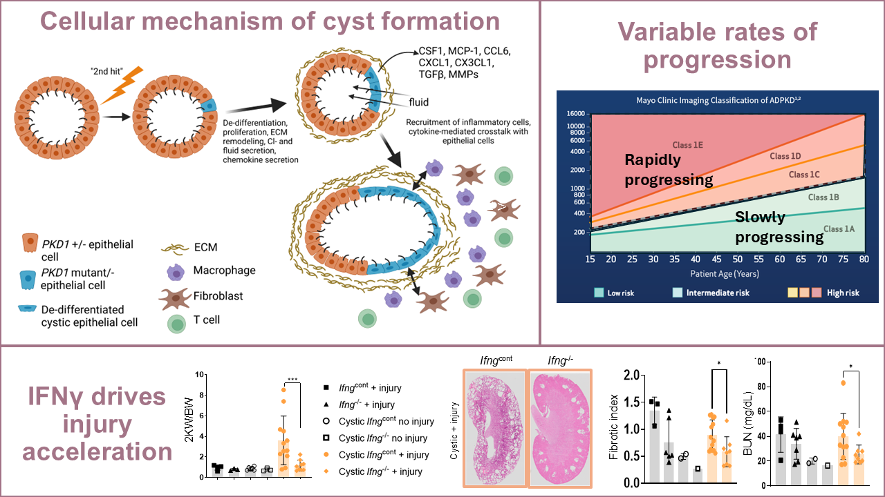
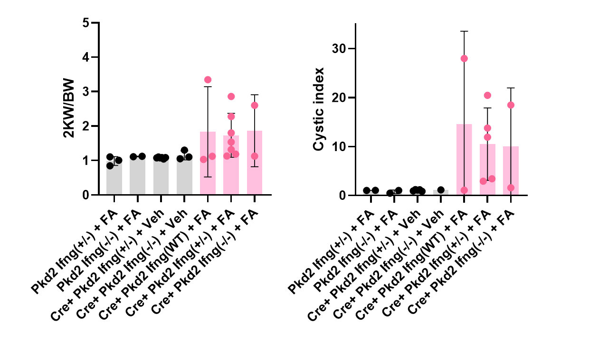
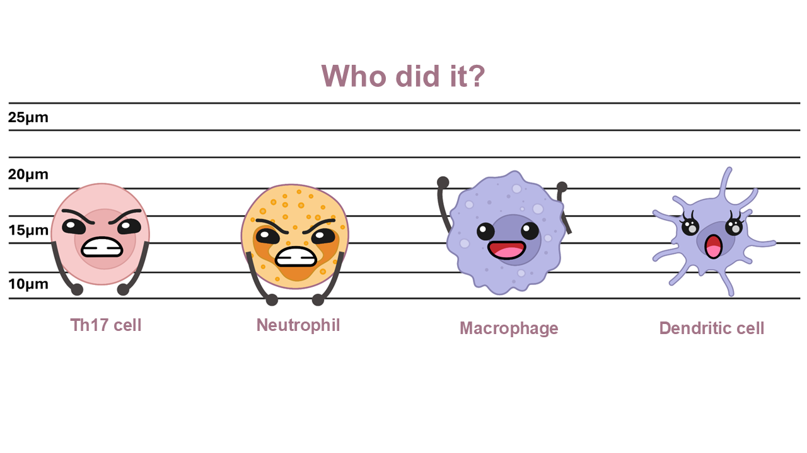

# Immune cells in injury accelerated Polycystic Kidney Disease: a crime scene investigation

## Introduction
{width="100%" fig-align="center"}
{width="100%" fig-align="center"}

This all looks great right? But there's a problem. The above data was shown in a less than favorable non-orthologous mouse model of PKD.

So I repeated the experiment with a different mouseline and got this:
{width="100%" fig-align="center"}

It appears the orthologous model does not match the phenotype. I show this data to my PI (the chief) and he tells me (rookie cop) that its a lead that is no longer worth following. He says there is no crime and therefore no suspects. But as I look through my data, I feel as though its not time to give up yet. 

{width="100%" fig-align="center"}

One issue is the batch of folic acid I used for injury. I think a lot of these mice didn't actually get injured.

Also, as I sift through my flow data, I notice that injured cystic mice seem to have really large populations of Th17 cells and neutrophils. I am wondering if these cell types might be the perpetrators hurting innocent kidneys.

**Crime:** Injury accelerated Polycystic kidney disease

**Suspects:** immune cells (specifically Th17 cells and neutrophils)

{width="100%" fig-align="center"}

## Experimental Methods

### For the injury model
#### Workflow
{width="60%" fig-align="left"}

#### Experimental groups

| Cystic | Treatment | Interferon gamma |
|--------|--------|---------|
| Yes | injured | + |
| Yes | injured | KO |
| Yes | non injured | + |
| Yes | non injured | KO |
| No | injured | + |
| No | injured | KO |

#### Analyses we performed
We performed flow cytometry, cystic analysis on H&E stained tissue, serum blood urea nitrogen (BUN) assay, and fibrosis analysis on PicroSirius stained tissue.


{width="80%" fig-align="center"}

## Results

First, here are the packages and rules I used for this analysis:

```{r}
#| echo: true
#| message: false
#| warning: false

library(readxl)
library(dplyr)
library(ggplot2)
library(tidyverse)
library(tidymodels)

# Read the data
data <- read_excel("injured_data.xlsx")

# Convert relevant columns to numeric
data <- data %>%
  mutate(across(c(contains("percent live immune"),
      `Th17 count`,
      `Neutrophil count`,
      `2KWBW`,
      `Cystic index`,
      `Cyst size`,
      `Cyst count`,
      `BUN D56`), as.numeric))

# Filter to cystic mice treated with folic acid (FA)
FA_cystic <- data %>%
  filter(`Cyst status` == "cystic",`Treatment` == "FA")

# Immune populations only
PLI <- FA_cystic %>%
  select(contains("percent live immune"))

# Immune populations + disease parameters
cor_data <- FA_cystic %>%
  select(contains("percent live immune"),
    `2KWBW`,
    `Cystic index`,
    `Cyst size`,
    `Cyst count`,
    `BUN D56`)
```


Now, lets look at the data. What groups do we have?
```{r}

colnames(data)

```

### How injured are these mice?

Lets look at their delta BUN a.k.a. change in kidney function pre-injury (D-1) and shortly after injury (D3).

```{r}

# Filter for cystic mice only
plot_data <- data %>%
  filter(`Cyst status` == "cystic") %>%
  mutate(Genotype = factor(Genotype, levels = c(
        "Cre(+) Pkd2(f/f) Ifng(WT)",
        "Cre(+) Pkd2(f/f) Ifng(+/-)",
        "Cre(+) Pkd2(f/f) Ifng(-/-)")))

g <- ggplot(plot_data, aes(x = Treatment, y = `Dneg1vD3 Delta BUN`, fill = Genotype)) +
  
# Reference line (guideline for injured or not)
  geom_hline(yintercept = 10, linetype = "dashed", color = "gray40", linewidth = 0.8) +
 
# Boxplots
  geom_boxplot(alpha = 0.75, linewidth = 0.8, outlier.shape = NA, position = position_dodge(width = 0.8)) +

# Individual mice
  geom_jitter(aes(color = Genotype), position = position_jitterdodge(jitter.width = 0.15, dodge.width = 0.8), size = 2.8) +
  
# Box colors
  scale_fill_manual(values = c(
      "Cre(+) Pkd2(f/f) Ifng(WT)"  = "darkorange2",
      "Cre(+) Pkd2(f/f) Ifng(+/-)" = "palevioletred1",
      "Cre(+) Pkd2(f/f) Ifng(-/-)" = "mediumpurple1"),
    labels = c(
      "IFNγ WT",
      "IFNγ +/-",
      "IFNγ KO"),
    name = expression(italic("Ifng") ~ "genotype")) +

# Point colors
  scale_color_manual(values = c(
      "Cre(+) Pkd2(f/f) Ifng(WT)"  = "darkorange4",
      "Cre(+) Pkd2(f/f) Ifng(+/-)" = "palevioletred3",
      "Cre(+) Pkd2(f/f) Ifng(-/-)" = "mediumpurple4"),
    guide = "none") +
  labs(title = expression(Delta*"BUN following FA treatment"), x = "Treatment", y = expression(Delta*"BUN (mg/dL)")) +
  theme_classic(base_size = 12) +theme(legend.position = "right")

g
```

Now I want to see if its worth generating a bunch more mice and waiting a minimum of 5 more months for better data.

### Does interferon gamma MFI correlate with cystic disease severity?

```{r}

#| layout-ncol: 3

library(readxl)
library(dplyr)
library(ggplot2)

# Read data
data <- read_excel("Ifng_MFI.xlsx")

# Convert relevant columns to numeric variables
data <- data %>%
  mutate(
    `Ifng+ T cells count` = as.numeric(`Ifng+ T cells count`),
    `Cyst size` = as.numeric(`Cyst size`),
    `Cyst count` = as.numeric(`Cyst count`),
    `Cystic index` = as.numeric(`Cystic index`))

# Filter to show only injured cystic mice
data <- data %>%
  filter(`Cyst status` == "cystic", Treatment == "FA")

# Function to make correlation plots
make_corr_plot <- function(yvar, ylabel, title) {

   # Remove missing values
  plot_df <- data %>%
    filter(!is.na(`Ifng+ T cells count`), !is.na(.data[[yvar]]))

  # Remove outliers (1.5 × IQR)
  plot_df <- plot_df %>%
    filter(between(.data[[yvar]], quantile(.data[[yvar]], 0.25, na.rm = TRUE) - 1.5 * IQR(.data[[yvar]], na.rm = TRUE), quantile(.data[[yvar]], 0.75, na.rm = TRUE) + 
      1.5 * IQR(.data[[yvar]], na.rm = TRUE)),
      between(
        `Ifng+ T cells count`,
        quantile(`Ifng+ T cells count`, 0.25, na.rm = TRUE) -
          1.5 * IQR(`Ifng+ T cells count`, na.rm = TRUE),
        quantile(`Ifng+ T cells count`, 0.75, na.rm = TRUE) +
          1.5 * IQR(`Ifng+ T cells count`, na.rm = TRUE)))

  # Fit linear model
  fit <- lm(plot_df[[yvar]] ~ plot_df$`Ifng+ T cells count`)

  # Get the  statistics
  r2 <- summary(fit)$r.squared
  p <- summary(fit)$coefficients[2, 4]

  # Make plot
  ggplot(plot_df, aes(x = `Ifng+ T cells count`, y = .data[[yvar]])) +
    geom_point(size = 3, color = "maroon4") +
    geom_smooth(method = "lm", se = TRUE, color = "firebrick") +
    annotate("text", x = Inf, y = Inf, hjust = 1.1, vjust = 1.5, label = sprintf("R² = %.2f\np = %.3g", r2, p), size = 4) +
    labs(title = title, x = "IFNγ+ T cell count", y = ylabel) +
    theme_classic(base_size = 12)
}

# Create plots
x <- make_corr_plot("Cyst size", "Cyst size", "IFNγ+ T cells vs Cyst size")

y <- make_corr_plot("Cyst count", "Cyst count", "IFNγ+ T cells vs Cyst count")

z <- make_corr_plot("Cystic index", "% Cystic index", "IFNγ+ T cells vs Cystic index")

# Show me plots
x
y
z

```

Looks like it does!

### Do Th17 cell proportions correlate with disease parameters?

```{r}
#| layout-ncol: 1

#### KW/BW
plot_data <- FA_cystic %>%
  filter(!is.na(`2KWBW`), !is.na(`Th17 percent live immune`))

# Fit linear model
fit <- lm(`Th17 percent live immune` ~ `2KWBW`, data = plot_data)

# Get statistics
r2 <- summary(fit)$r.squared
p <- summary(fit)$coefficients[2, 4]

a <- ggplot(plot_data, aes(x = `2KWBW`, y = `Th17 percent live immune`)) +
  geom_point(size = 4, color = "maroon4") +
  geom_smooth(method = "lm", se = TRUE, color = "firebrick") +
  annotate("text", x = Inf, y = Inf, hjust = 1.1, vjust = 1.5, label = sprintf("R² = %.2f\np = %.3g", r2, p), size = 4) +
  labs(title = "Correlation between 2KW/BW and Th17 cells as % live immune", x = "2KW/BW", y = "Th17 cells % live immune") +
  theme_classic(base_size = 12)

#### Cystic index
plot_data <- FA_cystic %>%
  filter(!is.na(`Cystic index`), !is.na(`Th17 percent live immune`))

# Fit linear model
fit <- lm(`Th17 percent live immune` ~ `Cystic index`, data = plot_data)

# Get statistics
r2 <- summary(fit)$r.squared
p <- summary(fit)$coefficients[2, 4]

b <- ggplot(plot_data, aes(x = `Cystic index`, y = `Th17 percent live immune`)) +
  geom_point(size = 4, color = "maroon4") +
  geom_smooth(method = "lm", se = TRUE, color = "firebrick") +
  annotate("text", x = Inf, y = Inf, hjust = 1.1, vjust = 1.5, label = sprintf("R² = %.2f\np = %.3g", r2, p), size = 4) +
  labs(title = "Correlation between Cystic index and Th17 cells as % live immune", x = "% Cystic index", y = "Th17 cells % live immune") +
  theme_classic(base_size = 12)

#### BUN
plot_data <- FA_cystic %>%
  filter(!is.na(`BUN D56`), !is.na(`Th17 percent live immune`))

# Fit linear model
fit <- lm(`Th17 percent live immune` ~ `BUN D56`, data = plot_data)

# Get some statistics
r2 <- summary(fit)$r.squared
p <- summary(fit)$coefficients[2, 4]

c <- ggplot(plot_data, aes(x = `BUN D56`, y = `Th17 percent live immune`)) +
  geom_point(size = 4, color = "maroon4") +
  geom_smooth(method = "lm", se = TRUE, color = "firebrick") +
  annotate("text", x = Inf, y = Inf, hjust = 1.1, vjust = 1.5, label = sprintf("R² = %.2f\np = %.3g", r2, p), size = 4) +
  labs(title = "Correlation between Endpoint BUN and Th17 cells as % live immune", x = "BUN (mg/dL)", y = "Th17 cells % live immune") +
  theme_classic(base_size = 12)

#Plot the plots
a
b
c
```

### Do neutrophil proportions correlate with disease parameters?

```{r}
#| layout-ncol: 1


#### KW/BW
# Fit linear model
fit <- lm(`Neutrophils percent live immune` ~ `2KWBW`, data = plot_data)

# Extract statistics
r2 <- summary(fit)$r.squared
p <- summary(fit)$coefficients[2, 4]

d <- ggplot(plot_data, aes(x = `2KWBW`, y = `Neutrophils percent live immune`)) +
  geom_point(size = 4, color = "darkorange1") +
  geom_smooth(method = "lm", se = TRUE, color = "firebrick") +
  annotate("text", x = Inf, y = Inf, hjust = 1.1, vjust = 1.5, label = sprintf("R² = %.2f\np = %.3g", r2, p), size = 4) +
  labs(title = "Correlation between 2KW/BW and Neutrophils as % live immune", x = "2KW/BW", y = "Neutrophils % live immune") +
  theme_classic(base_size = 12)

#### Cystic index
# Fit linear model
fit <- lm(`Neutrophils percent live immune` ~ `Cystic index`, data = plot_data)

# Extract statistics
r2 <- summary(fit)$r.squared
p <- summary(fit)$coefficients[2, 4]

e <- ggplot(plot_data, aes(x = `Cystic index`, y = `Neutrophils percent live immune`)) +
  geom_point(size = 4, color = "darkorange1") +
  geom_smooth(method = "lm", se = TRUE, color = "firebrick") +
  annotate("text", x = Inf, y = Inf, hjust = 1.1, vjust = 1.5, label = sprintf("R² = %.2f\np = %.3g", r2, p), size = 4) +
  labs(title = "Correlation between Cystic index and Neutrophils as % live immune", x = "% Cystic index", y = "Neutrophils % live immune") +
  theme_classic(base_size = 12)

#### BUN
# Fit linear model
fit <- lm(`Neutrophils percent live immune` ~ `BUN D56`, data = plot_data)

# Extract statistics
r2 <- summary(fit)$r.squared
p <- summary(fit)$coefficients[2, 4]

f <- ggplot(plot_data, aes(x = `BUN D56`, y = `Neutrophils percent live immune`)) +
  geom_point(size = 4, color = "darkorange1") +
  geom_smooth(method = "lm", se = TRUE, color = "firebrick") +
  annotate("text", x = Inf, y = Inf, hjust = 1.1, vjust = 1.5, label = sprintf("R² = %.2f\np = %.3g", r2, p), size = 4) +
  labs(title = "Correlation between Endpoint BUN and Neutrophils as % live immune", x = "BUN (mg/dL)", y = "Neutrophils % live immune") +
  theme_classic(base_size = 12)

#Let's plot those plots!
d
e
f

```

### Can we quantify correlation strength between each cell type vs disease parameter?

```{r}
# Calculate Spearman correlation matrix
cor_matrix <- cor(cor_data,
  use = "pairwise.complete.obs",
  method = "spearman")

# Keep only percent live immune (PLI) populations vs disease parameters
PLI_disease_cor <- cor_matrix[colnames(PLI), c("2KWBW", "Cystic index", "Cyst size", "Cyst count", "BUN D56")]

# Convert matrix to long format
heatmap_data <- as.data.frame(PLI_disease_cor) %>%
  tibble::rownames_to_column("Cell type") %>%
  pivot_longer(-`Cell type`, names_to = "Disease parameter", values_to = "Correlation")

# Plot heatmap
ggplot(heatmap_data, aes(x = `Disease parameter`, y = `Cell type`, fill = Correlation)) +
  geom_tile(color = "white") +
  geom_text(aes(label = sprintf("%.2f", Correlation)), size = 3.5) +
  scale_fill_gradient2(low = "steelblue4", mid = "white", high = "maroon4", midpoint = 0, limits = c(-1, 1), name = "Spearman") +
  labs(title = "Immune cell correlations with PKD disease severity", x = NULL, y = NULL) +
  theme_classic(base_size = 12) +
  theme(axis.text.x = element_text(angle = 45, hjust = 1), axis.text.y = element_text(size = 10))
```


## Discussion

Based on the first analysis, several of the mice used for the orthologous study did not receive sufficient kidney injury which could explain why the data does not recapitulate the initial study. 
The analysis showing interferon gamma correllation to cystic disease severity shows that it is worth adding additional cohorts of mice and exclusing uninjured mice based on delta BUN values. 

While correlations do not indicate causation, those showing positive relationships between Th17 cells, neutrophils, and cystic parameters highlight potential future routes of study. 

Myeloid cells appear to have very little influence on rapidly progressing disease. This data suggests that adaptive immune cells - specifically T cells are strongly correlated to rapidly progressing PKD in the context of injury and also without injury. 


## Conclusions and future directions

Injury accelerated cystic disease is driven by interferon gamma and adaptive inflammation in the orthologous mouse model. Th17 cells and neutrophils both strongly correlate with cystic disease severity. Unexpectedly, CD8 T cells and DN T cells may also be involved in this phenotype.

Future directions:
<ul>
<li>Keep adding more mice to orthologous study</li>
<li>Neutrophil depletion (anti Ly6g antibody)</li>
<li>**Graduate** <i class="bi bi-mortarboard"></i></li>
</ul>

## References

{width="100%" fig-align="center"}

---

**Last updated:** July 2026
